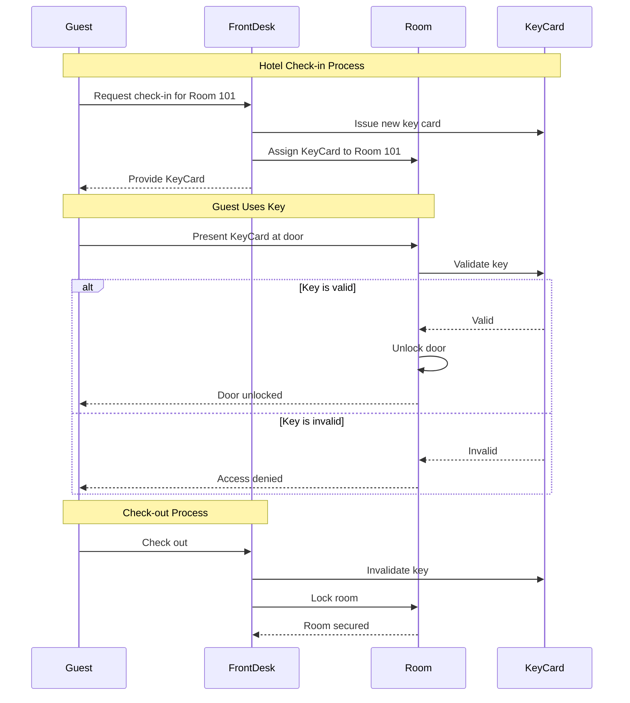

# Hotel Key Card System - Behavioral Modeling Example

This example demonstrates **behavioral modeling** in Alloy, showing how to model state transitions, actions, and temporal properties in a hotel key card access control system.

## Overview

The hotel key card system models a simplified version of how hotels manage room access:

- **Guests** check in and receive **key cards**
- Each key card **unlocks** a specific **room**
- Rooms can be **locked** or **unlocked**
- When guests **check out**, their keys become **invalid**
- The system enforces safety properties to ensure security

## Behavioral Modeling Concepts

This example demonstrates several key concepts from behavioral modeling:

### 1. State Variables

Using Alloy 6's `var` keyword to declare mutable state:
- `var sig CheckedIn in Guest` - which guests are currently checked in
- `var sig ValidKey in Key` - which keys are currently valid
- `var sig Locked in Room` - which rooms are currently locked

### 2. Actions as Predicates

Each action is modeled as a predicate with:
- **Guards**: Preconditions that must be true for the action to occur
- **Effects**: How the state changes (using primed variables like `CheckedIn'`)

Example actions:
- `checkin[g, r, k]` - guest checks in, receives key
- `unlock[g, k, r]` - guest unlocks room with key
- `checkout[g, k]` - guest checks out, key becomes invalid

### 3. Transition System

The `transitions` fact ensures the system evolves according to defined actions:
```alloy
fact transitions {
  init
  always (
    stutter or
    (some g: Guest, r: Room, k: Key | checkin[g, r, k]) or
    (some g: Guest, k: Key, r: Room | unlock[g, k, r]) or
    ...
  )
}
```

### 4. Temporal Properties

The model uses temporal logic operators:
- `always` - property holds in all states
- `eventually` - property holds in some future state
- `once` - property held in some past state

### 5. Safety Assertions

The model verifies critical safety properties:
- `OnlyValidKeysUnlock` - only valid keys can unlock rooms
- `CheckedOutGuestsCannotUnlock` - checked-out guests cannot unlock rooms

## Installation

```bash
cd examples/03-hotel-keys
npm install
```

## Usage

Run the example:

```bash
npm start
```

This will:
1. Execute the Alloy model
2. Display trace information in the console
3. Generate `output.md` with visualizations

## Output Visualizations

The example generates markdown output with **dynamically generated Mermaid diagrams**:

### Sequence Diagram

The sequence diagram is **automatically generated** from the actual trace execution by:
1. Comparing consecutive states to detect changes
2. Inferring which action occurred (checkin, unlock, lock, checkout, stutter)
3. Mapping actions to sequence diagram interactions

This shows the actual interaction flow between guests, front desk, rooms, and key cards as executed by the model:



### State Transition Diagram

Shows how the system state evolves over time, tracking:
- Number of locked rooms
- Number of checked-in guests
- Number of valid keys

The generated `output.md` file contains the complete trace with detailed state information at each step.

## Model Structure

### Signatures

**Static (unchanging):**
- `sig Room` - hotel rooms
- `sig Guest` - hotel guests
- `sig Key` - key cards

**Variable (changing over time):**
- `var sig CheckedIn in Guest` - currently checked-in guests
- `var sig ValidKey in Key` - currently valid keys
- `var sig Locked in Room` - currently locked rooms

### Relations

- `KeyMap.unlocks: Key -> Room` - which key unlocks which room
- `GuestKeys.holds: Guest -> Key` - which guest holds which key

### Actions

1. **checkin[g, r, k]** - Guest `g` checks into room `r` and receives key `k`
   - Guards: guest not checked in, room locked, key not valid
   - Effects: guest added to CheckedIn, key added to ValidKey, mappings updated

2. **unlock[g, k, r]** - Guest `g` uses key `k` to unlock room `r`
   - Guards: guest checked in, key valid, room locked, key unlocks room
   - Effects: room removed from Locked

3. **lock[r]** - Room `r` is locked (e.g., door closes)
   - Guards: room not locked
   - Effects: room added to Locked

4. **checkout[g, k]** - Guest `g` checks out with key `k`
   - Guards: guest checked in, guest holds key, key valid
   - Effects: guest removed from CheckedIn, key removed from ValidKey

## Visualization Features

This example includes advanced visualization capabilities:

### Action Inference

The JavaScript runner automatically infers which action occurred at each step by:
- **Comparing state changes**: Analyzes differences between consecutive states
- **Pattern matching**: Detects specific state change patterns (e.g., new CheckedIn + new ValidKey = checkin)
- **Action mapping**: Maps detected patterns to action types with parameters

Detected actions include:
- `init` - Initial state
- `checkin[guest, room, key]` - Guest checks in
- `unlock[guest, key, room]` - Guest unlocks room
- `lock[room]` - Room locks
- `checkout[guest, key]` - Guest checks out
- `stutter` - No state change

### Dynamic Diagram Generation

Both diagrams are generated from the actual execution:
- **Sequence diagram**: Shows message flow between participants based on inferred actions
- **State diagram**: Displays state evolution with metrics at each step

## Learning Resources

This example is based on concepts from:
- [Practical Alloy - Behavioral Modeling](https://practicalalloy.github.io/)
- [Alloy 6 Documentation](https://alloytools.org/alloy6.html)
- [Practical Alloy Models Repository](https://github.com/practicalalloy/models)

## Key Takeaways

1. **Behavioral models** capture how systems evolve over time through state transitions
2. **Actions** have guards (preconditions) and effects (state changes)
3. **Temporal logic** enables reasoning about properties that hold across time
4. **Safety properties** can be formally verified using assertions
5. **Alloy 6's var keyword** makes behavioral modeling natural and expressive

## Next Steps

Try modifying the model to:
- Add multiple rooms per guest
- Model key expiration times
- Add a master key for staff
- Implement room cleaning states
- Model key reuse policies

Happy modeling!
