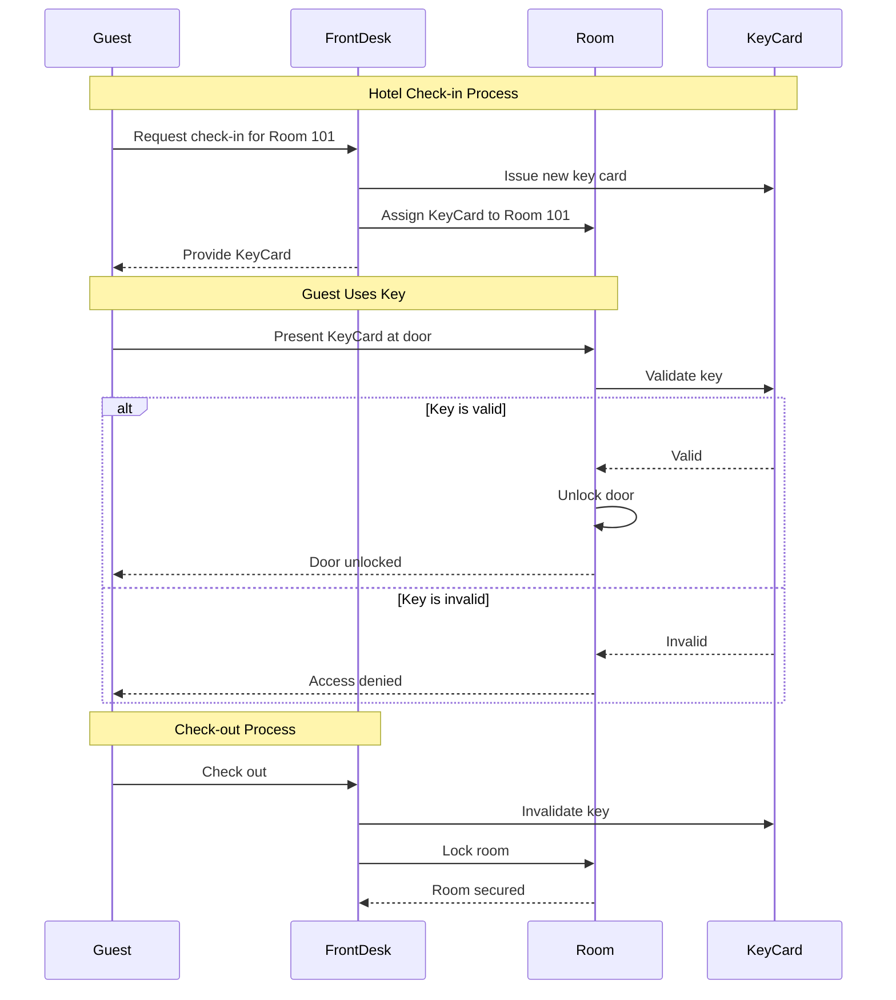
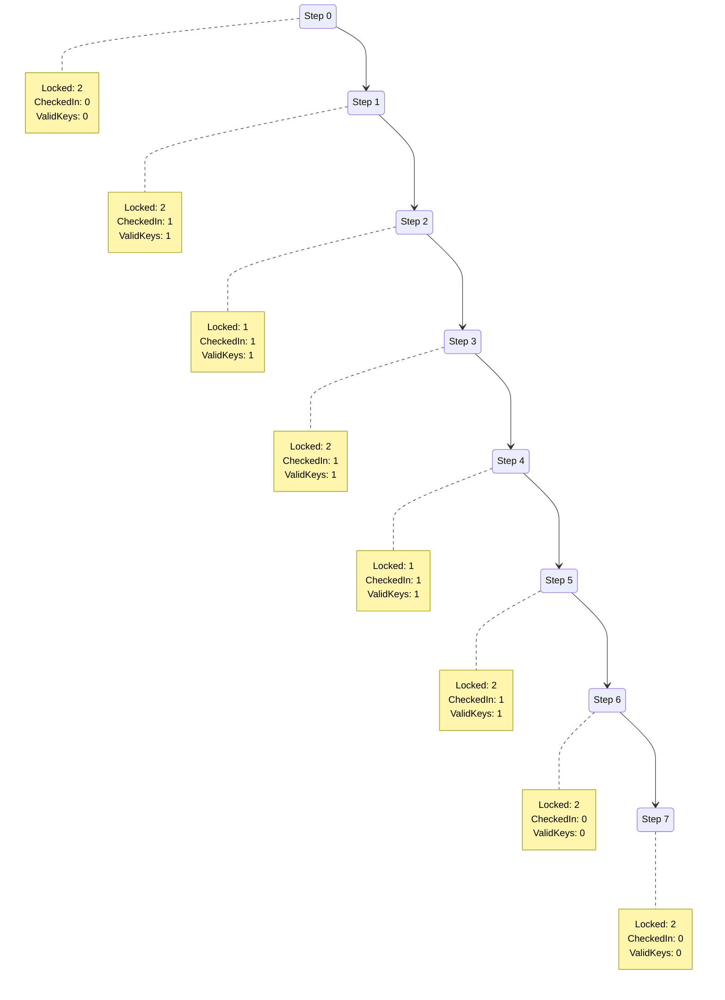

# Hotel Key Card System - Trace Visualization

This trace shows the execution of a hotel key card system model.

## System Overview

The hotel key card system models the following:
- **Guests** can check in to **Rooms**
- Each guest receives a **Key** card during check-in
- Keys can **unlock** their assigned rooms
- Rooms can be **locked** or **unlocked**
- When guests **check out**, their keys become **invalid**

## Sequence Diagram

## State Transition Diagram

## Actions Supported

1. **checkin**: Guest checks in, receives a valid key for a room
2. **unlock**: Guest uses valid key to unlock their room
3. **lock**: A room door locks (e.g., when closed)
4. **checkout**: Guest checks out, their key becomes invalid

## Safety Properties

The model verifies:
- **OnlyValidKeysUnlock**: Rooms can only be unlocked by valid keys
- **CheckedOutGuestsCannotUnlock**: Keys become invalid after checkout

## Detailed Trace

### Step 0

**Rooms:**
- Room$0: 🔒 LOCKED
- Room$1: 🔒 LOCKED

**Guests:**
- Guest$0: ✗ Not Checked In

**Initial State**: All rooms are locked, no guests are checked in, no valid keys exist.

### Step 1

**Rooms:**
- Room$0: 🔒 LOCKED
- Room$1: 🔒 LOCKED

**Guests:**
- Guest$0: ✓ Checked In
  - Has Key$0 (VALID)
    - Unlocks Room$0

**Action**: Guest$0 checks into Room$0 and receives Key$0.

### Step 2

**Rooms:**
- Room$0: 🔓 UNLOCKED
- Room$1: 🔒 LOCKED

**Guests:**
- Guest$0: ✓ Checked In
  - Has Key$0 (VALID)
    - Unlocks Room$0

**Action**: Guest$0 uses Key$0 to unlock Room$0.

### Step 3

**Rooms:**
- Room$0: 🔒 LOCKED
- Room$1: 🔒 LOCKED

**Guests:**
- Guest$0: ✓ Checked In
  - Has Key$0 (VALID)
    - Unlocks Room$0

**Action**: Room$0 locks again (door closes).

### Step 4

**Rooms:**
- Room$0: 🔓 UNLOCKED
- Room$1: 🔒 LOCKED

**Guests:**
- Guest$0: ✓ Checked In
  - Has Key$0 (VALID)
    - Unlocks Room$0

**Action**: Guest$0 unlocks Room$0 again with their valid key.

### Step 5

**Rooms:**
- Room$0: 🔒 LOCKED
- Room$1: 🔒 LOCKED

**Guests:**
- Guest$0: ✓ Checked In
  - Has Key$0 (VALID)
    - Unlocks Room$0

**Action**: Room$0 locks again (door closes).

### Step 6

**Rooms:**
- Room$0: 🔒 LOCKED
- Room$1: 🔒 LOCKED

**Guests:**
- Guest$0: ✗ Not Checked In
  - Has Key$0 (INVALID)

**Action**: Guest$0 checks out. Key$0 becomes invalid and can no longer unlock rooms.

### Step 7

**Rooms:**
- Room$0: 🔒 LOCKED
- Room$1: 🔒 LOCKED

**Guests:**
- Guest$0: ✗ Not Checked In
  - Has Key$0 (INVALID)

**Action**: System stutters (no state change). Guest$0 is checked out and their key remains invalid.

## Summary

This trace demonstrates a complete guest lifecycle:

1. **Initial State**: System starts with all rooms locked and no guests
2. **Check-in**: Guest checks in and receives a valid key card
3. **Room Access**: Guest can unlock their assigned room multiple times
4. **Door Locking**: Rooms automatically lock when doors close
5. **Check-out**: Guest checks out, invalidating their key card
6. **Security**: After checkout, the key cannot unlock any rooms

The model successfully verifies both safety properties:
- Only valid keys can unlock rooms (validated at steps 2 and 4)
- Checked-out guests cannot unlock rooms (validated at steps 6 and 7)
